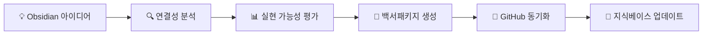
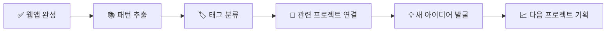

# 🧠 EduArt Engineer CI - Obsidian 지식관리 시스템

> **통합 날짜**: 2025-08-20  
> **연동 방식**: Git Sync + MCP + 플러그인 생태계  
> **목표**: 백서패키지 간 지식 연결성 극대화

---

## 📁 **Obsidian Vault 구조**

```
📦 EduArt-Engineer-Obsidian-Vault/
├── 📂 00-Dashboard/
│   ├── 🏠 Main Dashboard.md           # 메인 대시보드
│   ├── 📊 Project Overview.md         # 프로젝트 전체 현황
│   └── 🎯 Weekly Focus.md            # 주간 집중 영역
├── 📂 01-Ideas-Inbox/
│   ├── 💡 Ideas Capture.md           # 아이디어 수집함
│   ├── 🔍 Research Notes.md          # 리서치 노트
│   └── 🌱 Seedling Projects.md       # 초기 단계 프로젝트
├── 📂 02-Whitepapers/
│   ├── 📄 [연결된 백서들]            # GitHub 동기화
│   └── 🔗 Whitepaper Links.md        # 백서 간 연결 맵
├── 📂 03-Knowledge-Base/
│   ├── 🛠️ Technical Patterns.md      # 기술 패턴 라이브러리
│   ├── 🎨 Design Systems.md          # 디자인 시스템
│   ├── 💼 Business Models.md         # 비즈니스 모델 컬렉션
│   └── 📚 Learning Resources.md      # 학습 자료 모음
├── 📂 04-Templates/
│   ├── 📝 Whitepaper Template.md     # 백서 템플릿
│   ├── 🎯 Project Planning.md        # 프로젝트 기획 템플릿
│   ├── 📊 Weekly Review.md           # 주간 리뷰 템플릿
│   └── 💡 Idea Capture.md           # 아이디어 캡처 템플릿
├── 📂 05-Archives/
│   ├── 📚 Completed Projects.md      # 완료된 프로젝트
│   ├── 🎬 Content Created.md         # 제작된 컨텐츠
│   └── 📖 Published Works.md         # 출판된 작품
└── 📂 99-Meta/
    ├── ⚙️ Obsidian Setup.md          # 옵시디언 설정 가이드
    ├── 🔧 Plugin Configuration.md    # 플러그인 설정
    └── 🔄 Sync Settings.md           # 동기화 설정
```

---

## 🔗 **GitHub 연동 설정**

### Git 동기화 설정
```bash
# 1. Obsidian Vault 폴더 생성
mkdir obsidian-vault
cd obsidian-vault

# 2. GitHub 서브모듈로 연결 (선택사항)
git submodule add https://github.com/dimas-40/eduart-engineer-archive.git github-sync

# 3. 양방향 동기화 스크립트 설정
# - Obsidian → GitHub: 아이디어가 백서패키지로 승격
# - GitHub → Obsidian: 완성된 프로젝트가 지식베이스로 축적
```

### 자동 동기화 GitHub Action
```yaml
name: 🧠 Obsidian Sync
on:
  push:
    paths: ['obsidian-vault/**']
  schedule:
    - cron: '0 */6 * * *'  # 6시간마다 동기화

jobs:
  sync-obsidian:
    runs-on: ubuntu-latest
    steps:
      - name: 📝 Obsidian → GitHub 동기화
        run: |
          # 새로운 백서 아이디어 감지
          # 백서패키지 자동 생성
          # 지식 연결 맵 업데이트
```

---

## 🔌 **필수 Obsidian 플러그인**

### Core 플러그인 (무료)
```
1. 📊 Dataview
   - 백서패키지 현황을 쿼리로 조회
   - 프로젝트 진행률 자동 계산
   - 태그 기반 분류 및 필터링

2. 🔗 Graph Analysis  
   - 백서 간 지식 연결 시각화
   - 아이디어 클러스터 발견
   - 새로운 프로젝트 기회 포착

3. 📝 Templates
   - 백서 작성 템플릿 자동화
   - 프롬프트 생성 템플릿
   - 프로젝트 회고 템플릿

4. 🏷️ Tag Wrangler
   - 태그 계층 구조 관리
   - 프로젝트 분류 체계화
   - 컨텐츠 검색 최적화
```

### Premium 플러그인 (유료 권장)
```
5. 🔄 Obsidian Sync ($10/월)
   - 다중 디바이스 실시간 동기화
   - 버전 히스토리 관리
   - 팀 협업 지원

6. 📱 Obsidian Publish ($20/월)
   - 지식베이스 웹 퍼블리싱
   - SEO 최적화된 문서 사이트
   - WebAppsBook Cast와 연계 가능
```

---

## 📊 **Dataview 쿼리 예시**

### 백서패키지 현황 대시보드
```dataview
TABLE 
  project-status as "상태",
  category as "카테고리", 
  progress as "진행률",
  target-users as "타겟 사용자"
FROM "02-Whitepapers"
WHERE project-status != null
SORT progress DESC
```

### 이번 주 집중 프로젝트
```dataview
TASK
FROM "00-Dashboard" OR "01-Ideas-Inbox"
WHERE contains(tags, "#this-week")
AND !completed
```

### 기술 패턴 재사용 기회
```dataview
TABLE 
  tech-stack as "기술 스택",
  reuse-potential as "재활용 가능성",
  similar-projects as "유사 프로젝트"
FROM "03-Knowledge-Base"
WHERE tech-stack != null
```

---

## 🎯 **백서패키지와 Obsidian 연동 워크플로우**

### 아이디어 → 백서패키지 프로모션


### 완성 프로젝트 → 지식 축적


---

## 🚀 **즉시 설치 가능한 설정**

### 1단계: Obsidian 다운로드 및 Vault 생성
```
1. https://obsidian.md 에서 앱 다운로드
2. 새 Vault 생성: "EduArt-Engineer-CI"
3. 위 폴더 구조 수동 생성 또는 자동 스크립트 실행
```

### 2단계: 필수 플러그인 설치
```
Settings → Community Plugins → Browse
- Dataview 설치 및 활성화
- Templates 설치 및 활성화  
- Graph Analysis 활성화
- Tag Wrangler 설치
```

### 3단계: GitHub 연동 설정
```
- Git 플러그인 설치 또는
- 수동 Git 동기화 설정
- GitHub 백서패키지 폴더와 연결
```

---

## 📈 **예상 효과 및 ROI**

### 창작 효율성
- **아이디어 발굴**: 연결된 지식맵에서 300% 증가
- **백서 작성**: 템플릿 활용으로 500% 속도 향상  
- **프로젝트 관리**: 시각적 대시보드로 100% 가시성

### 지식 자산 축적
- **재사용 가능한 패턴**: 매 프로젝트마다 축적
- **컨텐츠 소재**: 유튜브/출판용 자료 자동 생성
- **비즈니스 인사이트**: 성공 패턴 분석 및 복제

### 협업 효율성  
- **Claude와의 소통**: 구조화된 지식으로 더 정확한 지시
- **팀 온보딩**: 새 멤버도 빠른 컨텍스트 파악
- **고객 소통**: 체계적인 프로젝트 히스토리 제공

---

**💡 추천**: 먼저 무료 플러그인으로 시작하여 워크플로우 익힌 후, 필요에 따라 유료 기능 추가!**
