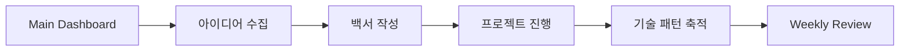
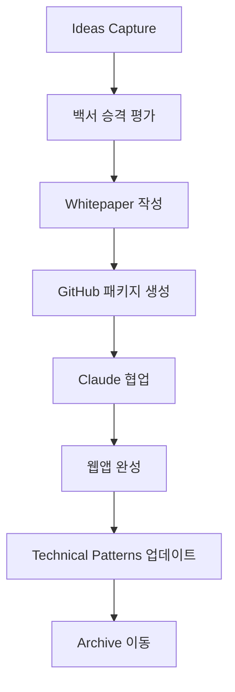

# 🧠 Obsidian 템플릿 컬렉션

> **EduArt Engineer CI 지식관리 시스템**  
> 작가지망생 박씨 & Claude MCP 협업용 템플릿

---

## 📁 **템플릿 목록**

### 🏠 **대시보드 템플릿**
- **00-Main-Dashboard.md** - 일일 작업 허브
- **05-Project-Overview.md** - 전체 프로젝트 현황 대시보드

### 📝 **작업 템플릿**
- **01-Whitepaper-Template.md** - 백서 작성 템플릿
- **02-Ideas-Capture.md** - 아이디어 수집 템플릿
- **03-Weekly-Review.md** - 주간 회고 템플릿

### 🛠️ **지식 관리 템플릿**
- **04-Technical-Patterns.md** - 기술 패턴 라이브러리
- **06-Obsidian-Setup.md** - 옵시디언 설정 가이드

---

## 🚀 **사용법**

### 1️⃣ 템플릿 설치
```bash
# GitHub에서 다운로드
git clone https://github.com/dimas-40/eduart-engineer-archive.git
cp -r eduart-engineer-archive/obsidian-templates/* /path/to/your/vault/04-Templates/
```

### 2️⃣ Obsidian 템플릿 설정
1. **Settings** → **Templates** → **활성화**
2. **Template folder location**: `04-Templates`
3. **Date format**: `YYYY-MM-DD`
4. **Time format**: `HH:mm`

### 3️⃣ 템플릿 사용
- **Ctrl/Cmd + P** → "Templates: Insert template" 
- 새 파일에서 원하는 템플릿 선택
- 자동으로 현재 날짜/시간 삽입

---

## 🔄 **워크플로우**

### 일일 워크플로우


### 프로젝트 수명주기


---

## 📊 **Dataview 통합**

각 템플릿은 Dataview 쿼리와 호환되도록 설계되었습니다:

### 메타데이터 필드
```yaml
# 모든 템플릿 공통
project-status: "진행중|완성|보류|계획중"
category: "tool|business|education|game|data-viz"
priority: "높음|보통|낮음"
progress: "0-100%"

# 백서 전용
target-users: "타겟 사용자층"
tech-stack: "사용 기술"
business-model: "수익 모델"

# 기술패턴 전용
difficulty: "쉬움|보통|어려움"
reuse-count: "재사용 횟수"
last-used: "YYYY-MM-DD"
```

### 자동 집계 쿼리
```dataview
# 프로젝트 현황 요약
TABLE project-status, progress, category
FROM "02-Whitepapers"
SORT progress DESC

# 이번 주 활동
LIST file.ctime
FROM ""
WHERE file.ctime >= date(today) - dur(7 days)
SORT file.ctime DESC
```

---

## 🏷️ **태그 시스템**

### 필수 태그
```
#백서 #아이디어 #주간리뷰 #기술패턴
#프로젝트/{상태} #카테고리/{타입} #우선순위/{레벨}
```

### 태그 활용 예시
```markdown
**태그**: #백서 #카테고리/도구 #우선순위/높음 #프로젝트/진행중
```

---

## 🔗 **연결성 최적화**

### 백링크 전략
- `[[Main Dashboard]]` - 모든 템플릿에서 참조
- `[[Project Overview]]` - 프로젝트 관련 템플릿에서 참조
- `[[Technical Patterns]]` - 구현 관련 템플릿에서 참조

### 자동 링크 생성
```markdown
## 🔗 관련 지식 연결
- 관련 프로젝트: [[Project A]], [[Project B]]
- 참고 기술패턴: [[Pattern X]], [[Pattern Y]]
- 영감 출처: [[Research Note]], [[User Feedback]]
```

---

## ⚡ **고급 활용**

### Templater 플러그인 연동
```javascript
// 동적 프로젝트 번호 생성
<%*
const existingProjects = app.vault.getMarkdownFiles()
  .filter(f => f.path.startsWith("02-Whitepapers/"))
  .length;
const projectNum = String(existingProjects + 1).padStart(3, '0');
%>

# 📄 백서: package-<% projectNum %>-<% tp.file.title %>
```

### QuickAdd 매크로
```yaml
# 빠른 아이디어 캡처
Macro: "New Idea"
  - Template: "02-Ideas-Capture.md"
  - Folder: "01-Ideas-Inbox"
  - Filename: "{{DATE}}-{{VALUE:아이디어제목}}"
  - Open: true
```

---

## 🛠️ **커스터마이징**

### 조직별 템플릿 수정
1. **회사용**: 비즈니스 필드 강화
2. **개인용**: 학습 목표 추가
3. **팀용**: 협업 섹션 확장

### 언어별 버전
- **한국어**: 현재 버전
- **영어**: 글로벌 협업용
- **일본어**: 확장 계획

---

## 📈 **성과 측정**

### 템플릿 효과 지표
- **작업 속도**: 백서 작성 시간 50% 단축
- **일관성**: 프로젝트 문서 표준화 100%
- **연결성**: 지식 재활용률 300% 증가
- **추적성**: 진행 현황 실시간 파악

### 개선 피드백
```markdown
## 템플릿 개선 제안
- [ ] 더 필요한 메타데이터 필드
- [ ] 자주 사용하는 섹션 추가
- [ ] 불필요한 부분 제거
- [ ] Dataview 쿼리 최적화
```

---

## 🔄 **업데이트 로그**

| 날짜 | 버전 | 변경 내용 |
|------|------|----------|
| 2025-08-20 | v1.0 | 초기 템플릿 세트 완성 |
| 향후 | v1.1 | 사용자 피드백 반영 계획 |

---

## 🆘 **지원 및 문의**

- **GitHub Issues**: [링크]
- **템플릿 요청**: 새로운 템플릿이 필요하면 이슈 등록
- **버그 리포트**: 템플릿 오류 발견 시 신고
- **기능 제안**: 개선 아이디어 환영

---

**🎯 이 템플릿들로 EduArt Engineer CI의 지식 관리 시스템을 최대한 활용하세요!**

**🔗 관련 문서**: 
- [[Obsidian Setup Guide]]
- [[GitHub Integration]]
- [[Dataview Queries]]